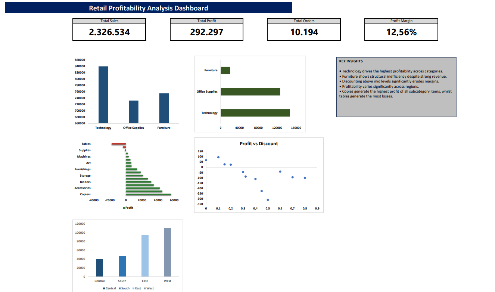

# Retail Profitability Analysis

## Project Overview

This project analyzes retail sales performance and profitability drivers using SQL and Excel.

The objective is to identify:

- High-performing product categories
- Unprofitable business segments
- Impact of discounts on profitability
- Regional profit differences

## Tools Used

- SQL
- Excel

## Dashboard Preview

## Key Findings

### Technology drives profitability

Technology contributes the largest share of profit across categories.

### Furniture underperforms

Despite strong revenue, furniture generates relatively low profit.

### Discounts reduce margins

Higher discount levels correlate with lower profitability.

### Regional disparities exist

Profitability varies significantly by region.

## Repository Structure

text
data/
sql/
dashboard/
images/
docs/

## Files

- Dataset
- SQL queries
- Excel dashboard
- Dashboard screenshots
